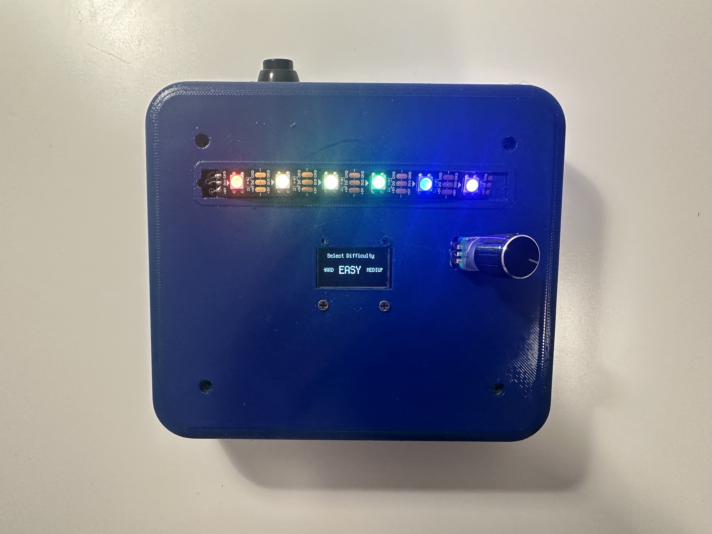
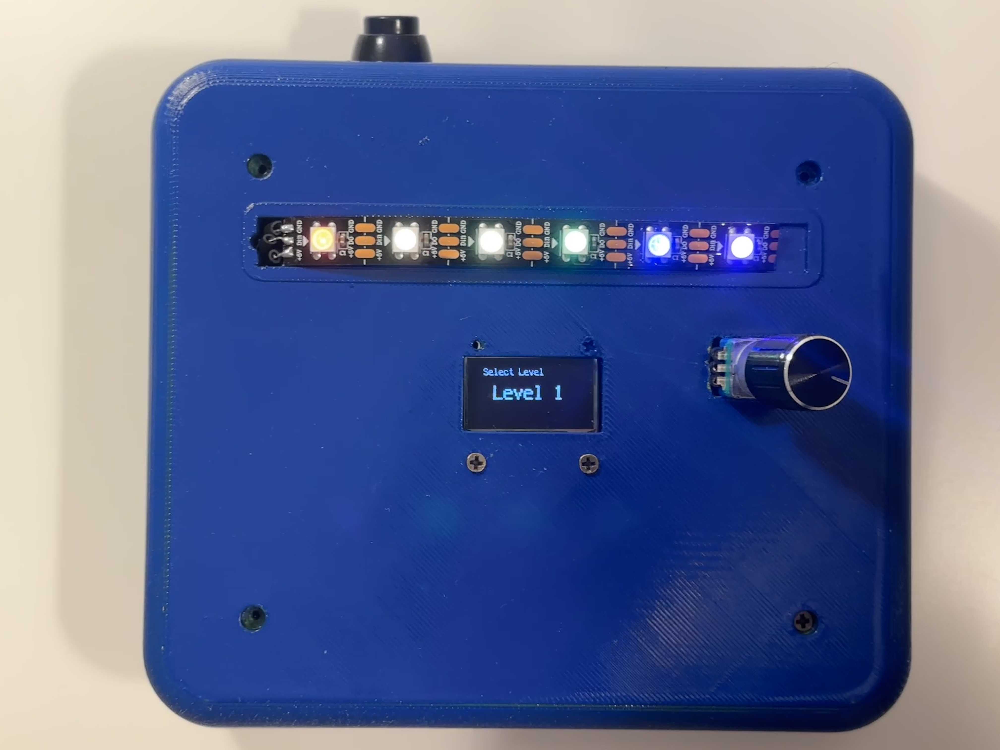
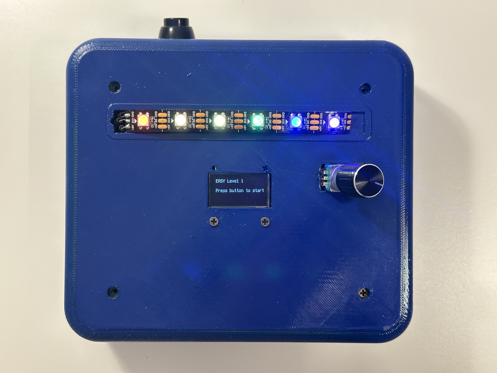
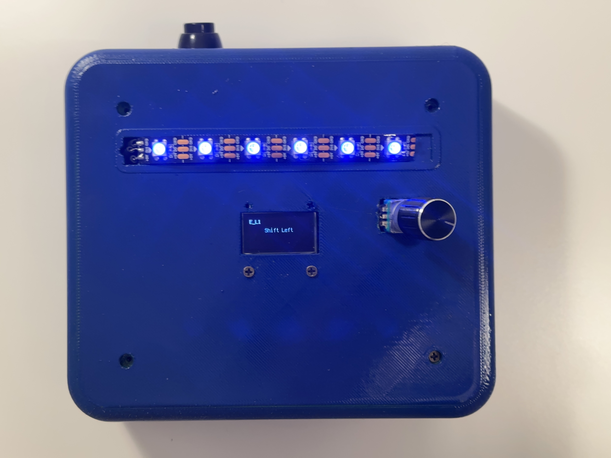
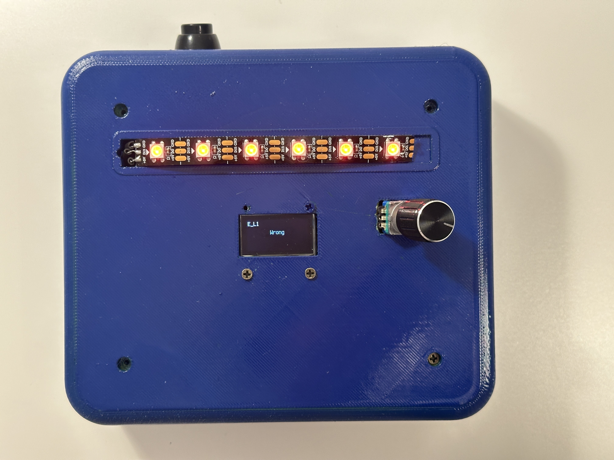
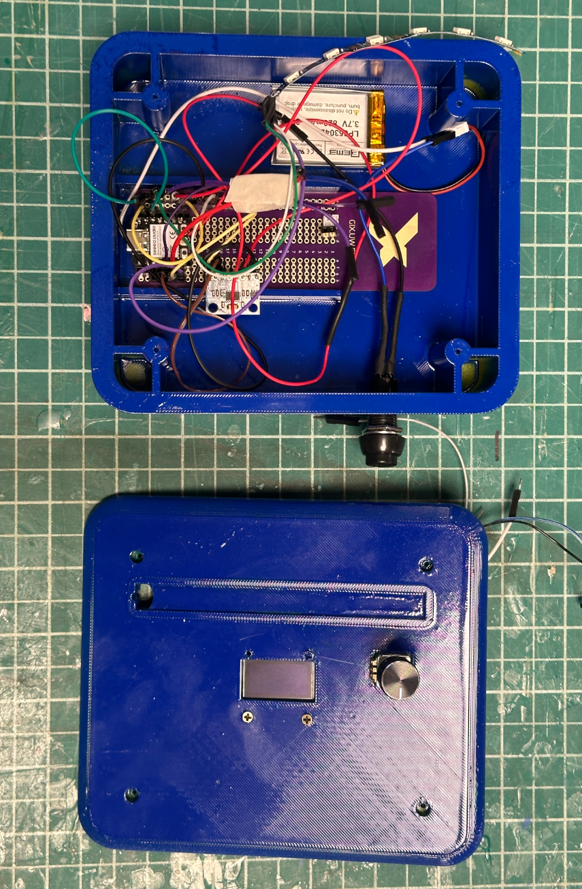
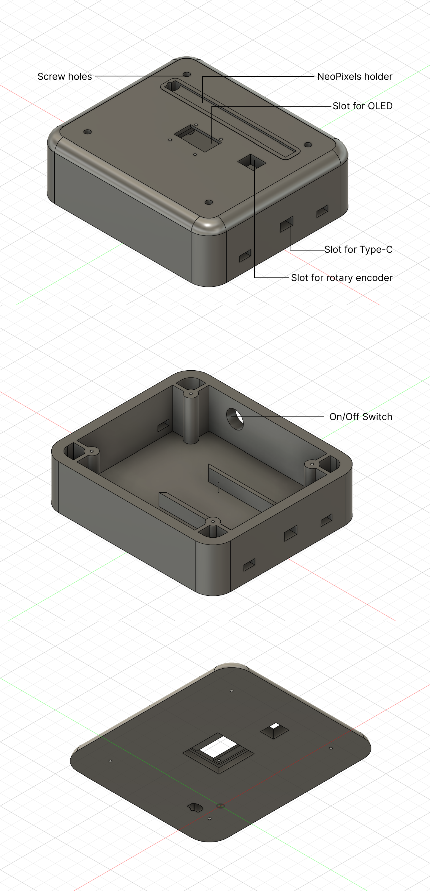

# Tilt Quest Game

## How to Play the Game 
The game is inspired by _Bop It_ . Players must respond quickly to the commands shown on the OLED screen. 

The five basic moves are: 
1. Shift left: Move the device leftward
2. Shift right: Move the device rightward
3. Shift forward: Move the device forward
4. Shift backward: Move the device backward
4. Twist (only for medium and hard level): Rotate the rotary encoder knob

Each round presents a random command. The player must complete the action before time runs out. 
As difficulty increases, the allowed reaction time becomes shorter, and the Twist action is added to the move set. 

Each level requires 6 correct moves to pass, and different levels and difficulties have different recognizable move threshold.  
Certain counts of mistakes or slow responses ends the game.

Red lights indicate wrong moves and fail.

Green lights indicate right moves and pass.

Blue lights occurs under other situations.  

 
 
 
 
 

## Components and Implementation 
### XIAO ESP32C3 
**Microcontroller:** The Seeed Studio XIAO ESP32C3 serves as the central controller of the entire system.
It runs the game logic written in CircuitPython, communicates with sensors through I2C and digital pins,
controls the OLED screen and NeoPixels, and processes all player inputs.

### ADXL345 Accelerometer 
**Sensor:** The ADXL345 detects tilt movements in real time and is responsible for recognizing the Shift Left/Right/Forward/Backward gestures. The raw acceleration values are continuously monitored, filtered, and compared against thresholds to determine which move the player performed.

### Rotary Encoder 
**Input:** The rotary encoder acts as an additional input device used for the Twist action and game menus. 
It is used to:

Input twist

Confirm the difficulty selection

Confirm the level selection

Restart a level after failure

### SSD1306 OLED Screen 
**Output:** The SSD1306 128×64 OLED display provides all visual feedback for the game.
It shows:

Difficulty selection menu

Current command (Shift, Twist, etc.)

Loading animations and progress bars

Game over screen

### NeoPixels 
**Output:** A strip of RGB NeoPixel LEDs generates colorful visual effects.
They illuminate during startup animations, flash to indicate correct or incorrect actions,
and contribute to the overall interactive and playful experience of the game.

### LiPo Battery 
**Power Supply:** The LiPo battery powers the entire device.

### Switch Push Button
**Input:** A momentary push button provides a manual input for on and off.

## Enclosure Design

 
